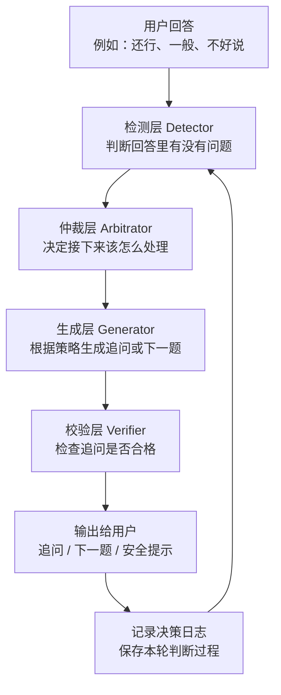
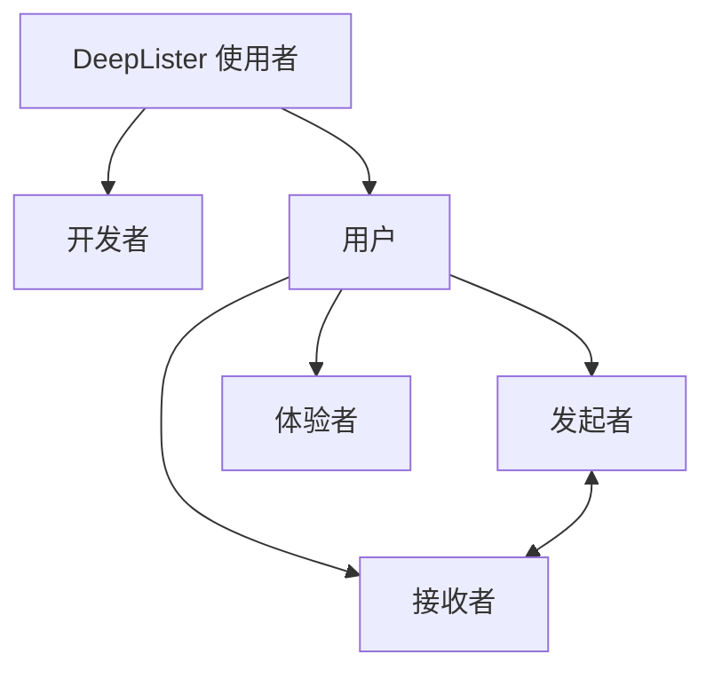
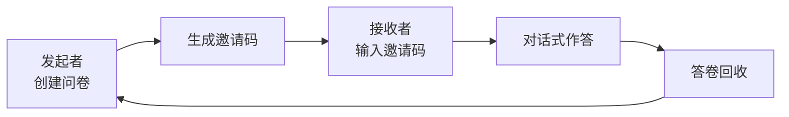
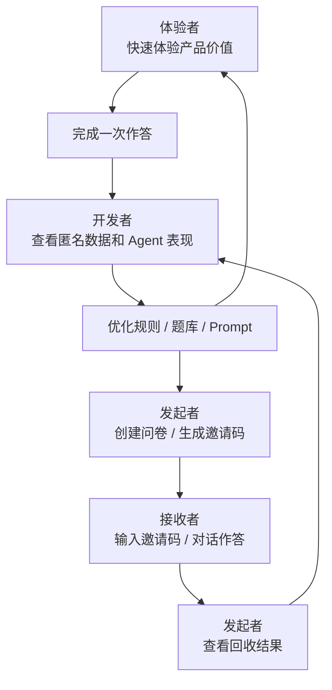
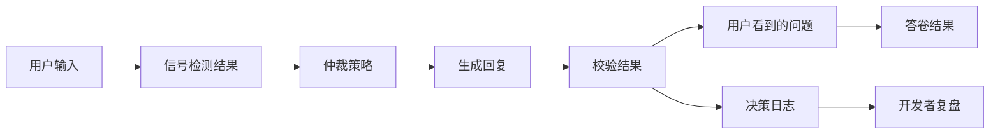

# DeepLister 项目介绍

> DeepLister 是一个追问式 AI 调研工作台，用四层追问架构让 AI 追问可控，用多角色产品闭环让调研流程真实可用。

## 项目概述

DeepLister 关注的不是“如何生成一份问卷”，而是“问卷执行过程中，系统如何处理用户含糊、不完整或前后不一致的回答”。

在传统问卷中，用户经常会回答“还行”“一般”“不好说”。这些回答虽然完成了作答动作，但很难直接形成高质量数据。DeepLister 将静态问卷转化为轻量访谈，在用户回答之后判断是否需要追问，并记录每轮追问背后的决策过程。

项目核心可以拆成两层：

- **技术内核**：四层追问架构，让 AI 不是自由聊天，而是按流程完成检测、仲裁、生成、校验。
- **产品外壳**：围绕开发者、发起者、接收者、体验者形成完整使用闭环，让项目具备真实发起、作答、回收和复盘能力。

---

## 1. 技术内核：四层追问架构

四层架构的职责如下：

| 层级 | 作用 | 说明 |
|---|---|---|
| 检测层 | 判断用户回答有没有问题 | 识别回答是否含糊、信息不足、前后矛盾，或存在安全风险 |
| 仲裁层 | 决定接下来怎么处理 | 用固定规则确定优先级，不把关键决策完全交给大模型 |
| 生成层 | 生成自然语言追问 | 根据策略生成更具体、更自然的问题 |
| 校验层 | 检查追问质量 | 防止追问重复、过长、跑偏或不安全 |

核心区别是：

> 普通 AI 问卷是“用户回答 → 大模型直接回复”。  
> DeepLister 是“用户回答 → 检测 → 仲裁 → 生成 → 校验 → 再回复”。

因此，DeepLister 更接近一个 **AI Harness 系统**，而不是单纯依靠 prompt 的聊天机器人。

---

## 2. 使用者划分

DeepLister 的使用者可以先分成两大类：**开发者**和**用户**。

用户下面再分成三类：**发起者、接收者、体验者**。其中，发起者和接收者共同构成一次真实调研关系。

不同角色的划分如下：

| 角色 | 定义 | 主要关注点 | 划分原因 |
|---|---|---|---|
| 开发者 | 维护和优化 DeepLister 的人 | Agent 表现、匿名回流、追问效果 | 负责持续优化系统 |
| 发起者 | 想收集信息的人 | 创建问卷、生成邀请码、查看结果 | 拥有一次调研任务 |
| 接收者 | 被邀请填写的人 | 输入邀请码，完成对话式作答 | 贡献真实答卷 |
| 体验者 | 第一次试用产品的人 | 不准备问卷，快速理解产品价值 | 降低首次使用门槛 |

发起者和接收者是一组真实调研关系：

发起者负责提出问题，接收者负责回答问题，DeepLister 在中间负责追问、整理和记录，并将结果回收到发起者侧。

体验者单独存在，是为了降低第一次使用门槛。体验者不需要准备问卷，也不需要邀请码，可以通过快速体验、样例问卷或 MBTI 体验理解产品价值。

---

## 3. 产品外壳：四类用户闭环

DeepLister 的产品外壳不是“四种孤立体验”，而是围绕不同使用者路径形成的产品闭环。

四类角色对应的闭环价值如下：

| 角色 | 可完成的动作 | 对产品闭环的意义 |
|---|---|---|
| 体验者 | 不上传问卷，直接快速体验 | 解决首次访问时不知道如何理解产品的问题 |
| 发起者 | 创建问卷、上传问卷、生成邀请码 | 让项目从 Demo 变成可发起的调研工具 |
| 接收者 | 通过邀请码进入，像聊天一样回答 | 让问卷真正被填写和回收 |
| 开发者 | 查看匿名回流、追问触发率、含糊回答比例 | 用真实使用数据改进 Agent |

这套产品闭环让 DeepLister 不只是一个聊天入口，而是按照真实使用需求拆分出不同路径：

- 体验者负责快速理解产品价值；
- 发起者和接收者负责完成真实调研；
- 开发者负责根据匿名回流继续优化系统。

---

## 4. 技术数据流：每轮对话都可复盘

DeepLister 每一轮对话不仅保存用户答案，还保存系统为什么追问、采用了什么策略、追问是否通过检查。这样，系统可以被解释、被调试，也可以持续迭代。

每轮对话沉淀的数据包括：

| 数据 | 说明 |
|---|---|
| 用户输入 | 用户这一轮说了什么 |
| 信号检测结果 | 是否含糊、信息不足、矛盾或有安全风险 |
| 仲裁策略 | 系统决定追问、推进还是安全提示 |
| 生成回复 | AI 生成给用户看的问题 |
| 校验结果 | 这句话有没有重复、过长、跑偏或不安全 |
| 决策日志 | 留给开发者复盘和优化的记录 |

因此，DeepLister 不只是“会问问题”，而是能解释自己为什么这样问。

---

## 5. 项目价值总结

DeepLister 的核心价值不在于做了一个聊天界面，而在于把 AI 追问拆成了可控流程。

技术上，系统通过四层架构完成追问控制：检测层判断用户回答有没有问题，仲裁层用规则决定追问策略，生成层将策略转化为自然语言，校验层检查追问是否跑偏。这样 AI 不是自由发挥，而是在系统约束下完成追问。

产品上，DeepLister 将使用者分成开发者和用户，用户进一步分为发起者、接收者和体验者。发起者和接收者共同完成真实调研闭环：发起者创建问卷并生成邀请码，接收者通过邀请码作答，结果再回收到发起者侧。体验者则用于降低首次使用门槛，让没有问卷、没有邀请码的人也能快速理解产品价值。

开发者可以通过匿名回流和 Agent 表现数据，持续优化规则、题库和 Prompt。这样，DeepLister 就不只是一个心理测评 Demo，而是一个从发起、作答、回收、复盘到迭代的 AI 调研工作台。

---

## 6. 项目定位总结

更准确的表述是：

> DeepLister 的核心是“四层可控追问引擎”，外层是“围绕不同使用者设计的产品闭环”。  
> 四层引擎解决 AI 追问是否可靠，产品闭环解决项目是否能真实落地。

如果进一步压缩成一句话：

> **DeepLister 用四层追问架构让 AI 追问可控，用多角色产品闭环让调研流程真实可用。**

项目边界：

> 当前版本帮助用户更准确地表达主观感受，不做心理诊断；存储层目前用本地 JSON 模拟云盘，正式产品可以替换成数据库或真实云存储。
